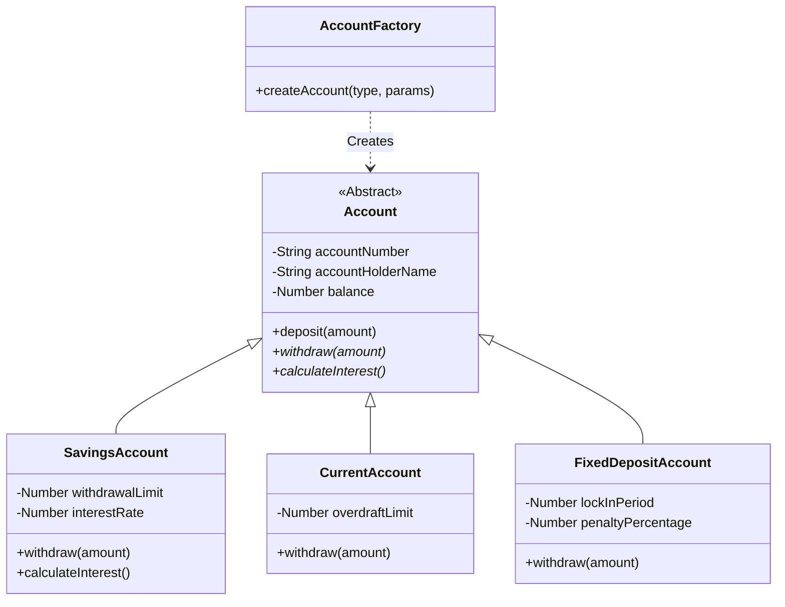
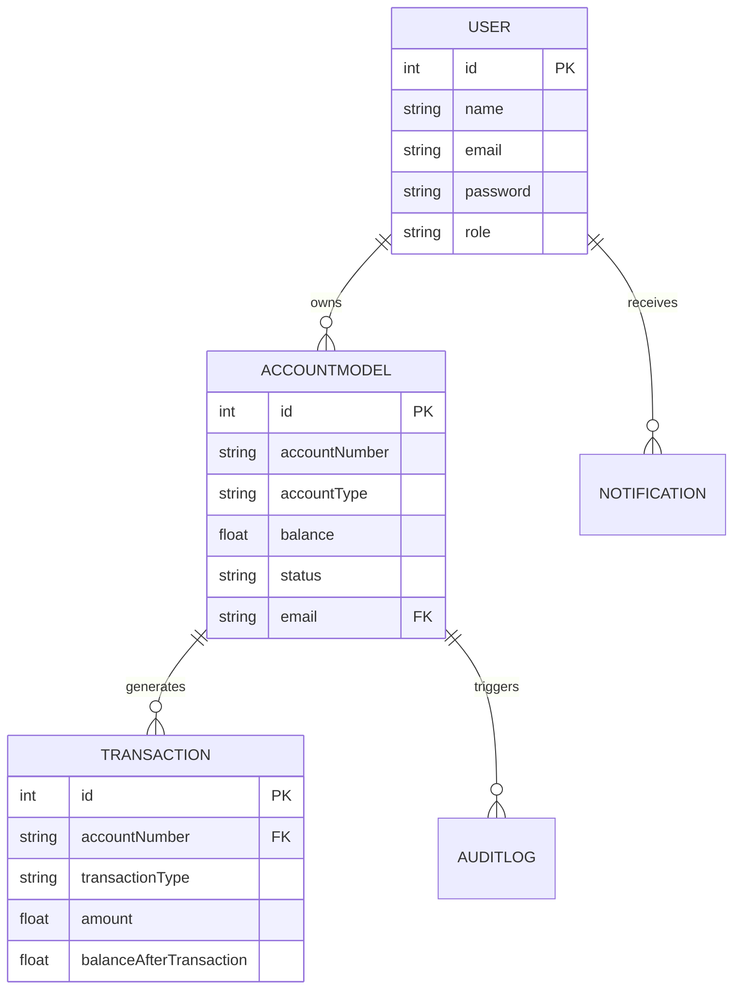
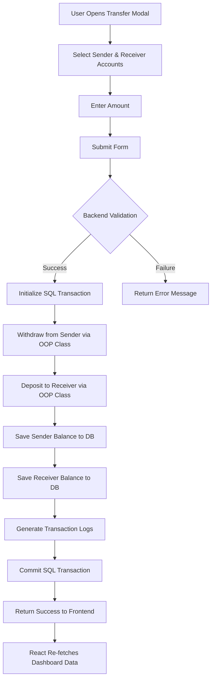

# Banking Management System - Project Report

## 1. Introduction
The Bank Account Type Hierarchy System is a full-stack web application designed to simulate real-world online banking operations. The project's primary goal is to provide a highly interactive, scalable, and secure platform for customers to manage their finances, while serving as a comprehensive demonstration of Object-Oriented Programming (OOP) concepts within a modern web framework architecture.

## 2. System Architecture (MVC)
The application follows the Model-View-Controller (MVC) architectural pattern:
- **Model:** Sequelize ORM mapping to MySQL tables (`User`, `AccountModel`, `Transaction`, `AuditLog`, `Notification`).
- **View:** React.js frontend displaying dynamic data (Dashboard, Profile, Statements, Modals).
- **Controller:** Express.js routing logic handling business operations (e.g., `accountController.js`, `authController.js`).

## 3. OOP Implementation

### Abstraction & Encapsulation
The base `Account` class serves as an abstract blueprint. It encapsulates sensitive data using private fields (e.g., `#balance`, `#transactions`) that can only be modified through controlled, validated methods like `deposit()` and `withdraw()`. 

### Inheritance & Polymorphism
Three distinct classes (`SavingsAccount`, `CurrentAccount`, `FixedDepositAccount`) inherit from the base `Account` class. Polymorphism is heavily utilized via Method Overriding:
- A withdrawal on a `SavingsAccount` validates against a daily withdrawal limit.
- A withdrawal on a `CurrentAccount` allows drawing past a zero balance up to a defined `#overdraftLimit`.
- A withdrawal on a `FixedDepositAccount` calculates and deducts a `#penaltyPercentage` if withdrawn before maturity.

### Factory Pattern
The `AccountFactory` class abstracts the instantiation logic, ensuring the correct object type is generated based on a string literal (e.g., `AccountFactory.createAccount('Savings', {...})`).

## 4. Diagrams

### 4.1 UML Class Diagram

### 4.2 Entity Relationship (ER) Diagram

### 4.3 Activity Flowchart (Funds Transfer)

## 5. Security Measures
- **Authentication:** Stateless authentication utilizing JSON Web Tokens (JWT).
- **Password Hashing:** `bcryptjs` is utilized to securely hash and salt user passwords before database insertion.
- **Data Integrity:** All multi-step financial operations (like money transfers) utilize SQL Transactions. If any step fails (e.g., database crash mid-transfer), the transaction rolls back, preventing lost or duplicated funds.
