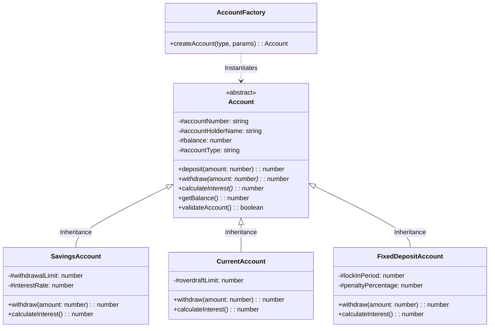
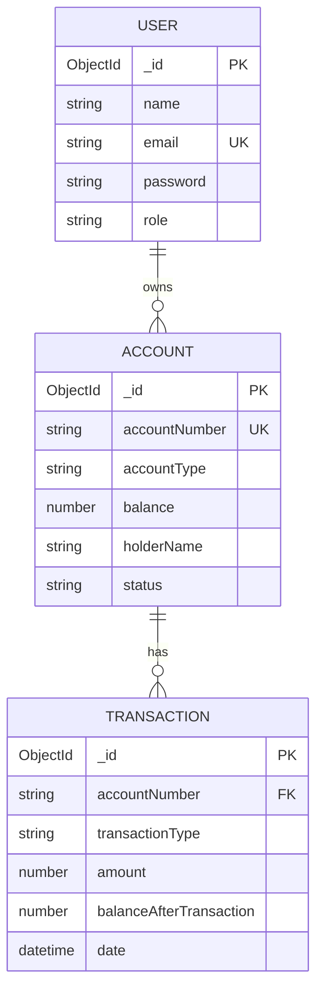
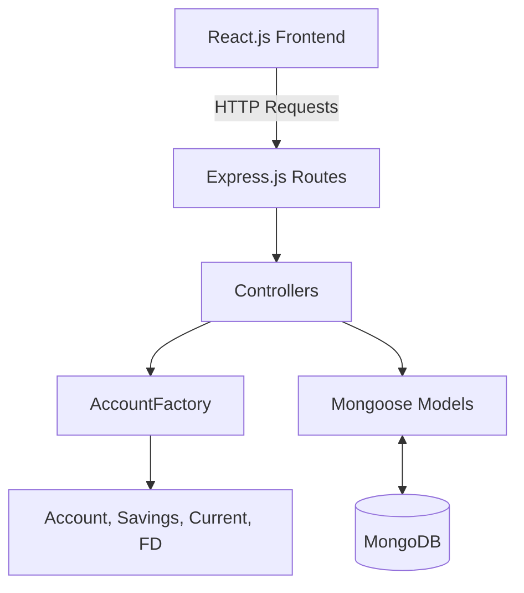

# Bank Account Type Hierarchy System - Project Diagrams

## 1. UML Class Diagram
This diagram illustrates the core Object-Oriented structure of the application.

## 2. ER Diagram (Database Schema)

## 3. Architecture Diagram (MVC + Services)

